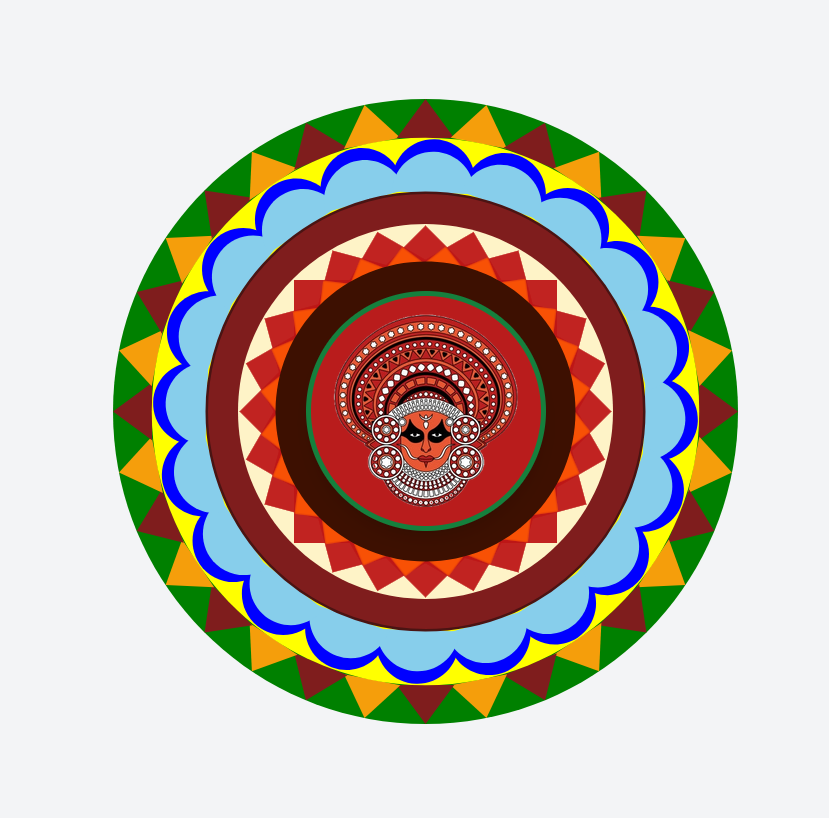

# 🌸 Mevin's Pookalam 2025 🌸

## 👨‍💻 About Me
- **Name:** Mevin Aby Manu
- **Institution/Company:** Mar Baselios Christian College of Engineering and Technology, Peermade
- **GitHub:** [@MEV1N](https://github.com/MEV1N)
- **Programming Language Used:** React

## 🎨 My Pookalam

### Description
My digital Pookalam is a stunning web-based recreation of traditional Kerala floral art combined with the iconic Theyyam cultural heritage, built using React, TypeScript, and modern web technologies. This project beautifully merges the geometric precision of Pookalam designs with the mystical essence of Theyyam, creating a unique digital tribute to Kerala's rich cultural traditions.

The design features intricate concentric patterns with alternating colored triangular borders, decorative geometric overlays, and a central Theyyam face that represents the divine performer from Kerala's traditional ritual art form. Using SVG graphics and React components, the Pookalam showcases layered circular patterns with a warm autumn color palette featuring deep maroons, golden yellows, rust oranges, and vermilion reds that are characteristic of both Pookalam and Theyyam art forms.

### Design Elements
- **Outer Border**: 32 alternating Golden Yellow and Rust Orange triangular petals forming the outermost ring
- **Secondary Layer**: Decorative scallop petals in rich Vermilion creating depth and texture
- **Diamond Pattern**: Alternating Cream and Orange diamond shapes in the middle layer
- **Inner Circle**: Ochre Yellow central circle with intricate detailing
- **Decorative Rings**: Mahogany colored circular bands providing structural definition
- **Geometric Overlays**: Rotating rectangular patterns in Rust Orange and Golden Yellow with transparency effects
- **Central Theyyam**: Traditional Theyyam face with detailed eyes, nose, and decorative elements in Mahogany and Cream
- **Floral Accents**: 28 small decorative flowers in Vermilion and Golden Yellow arranged in a circular pattern
- **Background**: Deep Dark Maroon providing rich contrast and traditional aesthetic

### Preview

*Digital Pookalam featuring Theyyam-inspired central design*

### Features
- **Traditional Kerala Art Fusion**: Combines Pookalam floral patterns with Theyyam cultural elements
- **Geometric Precision**: Mathematical arrangement of patterns and colors using SVG graphics
- **Authentic Color Palette**: Features traditional autumn colors - Dark Maroon, Golden Yellow, Rust Orange, Vermilion, Mahogany, Cream, and Ochre Yellow
- **Cultural Authenticity**: Uses traditional Kerala design motifs and color schemes representing festival aesthetics
- **Layered Design**: Multiple concentric layers creating depth and visual complexity
- **Responsive Design**: Built with modern web technologies for cross-device compatibility

## 🚀 How to Run

### Prerequisites
Make sure you have Node.js (version 16 or higher) installed on your system.

### Installation & Setup
```bash
# Clone the repository
git clone https://github.com/MEV1N/CODE-A-POOKALAM-2025-COMPETITION.git

# Navigate to the project directory
cd CODE-A-POOKALAM-2025-COMPETITION

# Install dependencies
npm install

# Start the development server
npm run dev
```

### Build for Production
```bash
# Build the project
npm run build

# Preview the production build
npm run preview
```

### Technologies Used
- **React 18**: Modern React with functional components
- **TypeScript**: Type-safe JavaScript for better development experience
- **Vite**: Fast build tool and development server
- **Tailwind CSS**: Utility-first CSS framework for styling
- **SVG Graphics**: Scalable vector graphics for the Pookalam design
- **Framer Motion**: Animation library for smooth interactions
- **Lucide React**: Beautiful icon library

### Project Structure
```
src/
├── App.tsx          # Main Pookalam component with SVG design
├── main.tsx         # React application entry point
├── index.css        # Global styles and Tailwind imports
└── vite-env.d.ts    # TypeScript environment declarations
```

